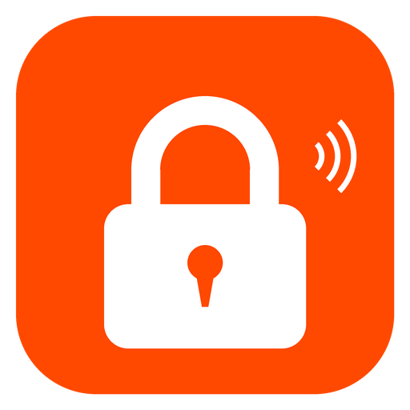

<p align="center">
  
</p>

<h1 align="center">Tuya BLE Lock</h1>

<p align="center">
  Local Bluetooth smart lock integration for Home Assistant.<br>
  Zero cloud dependency after initial setup.
</p>

---

A [Home Assistant](https://www.home-assistant.io/) custom integration for controlling Tuya-based BLE smart door locks **entirely over local Bluetooth**. Cloud credentials are used once during setup to fetch encryption keys — after that, all lock/unlock operations, credential management, and status updates happen directly over BLE.

## Supported Hardware

Both are lever-style smart locks with a latchbolt mechanism (bolt retracts when the lever is pushed and springs back on release).

| Device | Product ID | Chip | Protocol | Notes |
|--------|-----------|------|----------|-------|
| [Smart Lock 3](https://manuals.plus/asin/B0CD1CHYK8) | `qqmu5mit` | SYD8811 | V4 | DP 520 battery |
| [H8 Pro](https://manuals.plus/asin/B0FDB2NSP3) | `wwbdbt3h` | — | V3 | Passage mode, auto-lock timer |

Other Tuya BLE locks in the `jtmspro` category will likely work with the default profile. See [Adding New Devices](#adding-new-devices) to create a profile for your lock.

## Quick Start

### Install via HACS

1. In HACS, go to **Integrations** > **Custom repositories**
2. Add `https://github.com/tkhadimullin/tuya_ble_lock` as an **Integration**
3. Install "Tuya BLE Lock" and restart Home Assistant
4. Go to **Settings > Devices & Services > Add Integration > Tuya BLE Lock**
5. Follow the setup wizard (cloud-assisted recommended)

For detailed setup instructions, entity descriptions, and service documentation, see the [full integration docs](docs/integration.md). For managing PINs, fingerprints, NFC cards, and temporary passwords, see the [credential management guide](docs/credential-management.md).

## Adding New Devices

The integration uses JSON device profiles to handle per-model differences. To add support for a new lock:

1. Copy `custom_components/tuya_ble_lock/device_profiles/_default.json` as a starting point
2. Rename it to your lock's `product_id` (visible in the Tuya app or cloud API), e.g. `abc123de.json`
3. Fill in the profile fields:

```json
{
  "product_id": "abc123de",
  "name": "My Lock Model",
  "model": "Model Name",
  "category": "jtmspro",
  "entities": {
    "lock": {
      "unlock_dp": 71
    },
    "battery_sensor": {
      "dp": [8]
    },
    "volume_select": {
      "dp": 31,
      "dp_type": "enum",
      "options": ["mute", "normal"]
    }
  },
  "services": {
    "add_pin": { "dp": 1 },
    "delete_credential": { "dp": 2 }
  },
  "state_map": {
    "8":  { "key": "battery_percent", "parse": "int" },
    "47": { "key": "motor_state", "parse": "bool" },
    "31": { "key": "volume", "parse": "raw_byte" }
  }
}
```

### Profile Reference

**`entities`** — controls which HA entities are created:

| Key | Entity | Notes |
|-----|--------|-------|
| `lock` | Lock entity | `unlock_dp` is the DP used for lock/unlock (usually 71) |
| `battery_sensor` | Battery sensor | `dp`: array of DPs to read. Optional `trigger_dp` + `trigger_payload` for models that need a trigger. |
| `volume_select` | Volume dropdown | `options`: list of volume level names |
| `double_lock_switch` | Privacy lock switch | `dp`: DP number, `dp_type`: `"bool"` |
| `passage_mode_switch` | Passage mode switch | `dp`: DP number, `dp_type`: `"bool"` |
| `auto_lock_time_number` | Auto-lock delay | `dp`, `dp_type`: `"value"`, `min`, `max`, `unit` |

**`state_map`** — maps incoming DP reports to internal state keys:

| Parse type | Description |
|-----------|-------------|
| `int` | Integer value (e.g. battery percentage) |
| `bool` | Boolean (True/False) |
| `raw_byte` | Single byte as integer |
| `battery_state_enum` | Maps to high/medium/low/exhausted |
| `ignore` | DP is received but discarded |

**`services`** — maps service calls to DPs:

| Key | Service | Notes |
|-----|---------|-------|
| `add_pin` | PIN enrollment | `dp`: credential DP (usually 1) |
| `add_fingerprint` | Fingerprint enrollment | `dp`: credential DP, optional `sync_dp` |
| `add_card` | Card enrollment | `dp`: credential DP, optional `sync_dp` |
| `delete_credential` | Delete credential | `dp`: delete DP (usually 2) |
| `create_temp_password` | Temporary password | `dp`: temp password DP (usually 51) |

**`protocol_version`** — set to `3` for V3 devices (1-byte DP length). Defaults to `4`.

### Finding Your Lock's DPs

To discover which DPs your lock supports, you'll need a Tuya IoT Platform developer account. The best guide for setting this up is the [LocalTuya Cloud API setup guide](https://xzetsubou.github.io/hass-localtuya/cloud_api/). Once configured, you can query your device's DP schema through the Tuya IoT Platform's **Device Management** page.

## Development Tools

The `tools/` directory contains standalone scripts used during development. These are useful for debugging, protocol analysis, and direct lock interaction outside of Home Assistant.

### lock_control.py

Direct BLE lock control CLI. Supports all lock operations.

```bash
cd tools/

# Unlock/lock
python3 lock_control.py unlock71
python3 lock_control.py lock71

# Read status
python3 lock_control.py status

# Manage credentials
python3 lock_control.py add-pin 1 123456
python3 lock_control.py add-fingerprint 2
python3 lock_control.py delete-method 1 password 1

# Change settings
python3 lock_control.py volume normal
python3 lock_control.py double-lock on
python3 lock_control.py auto-lock on

# Write arbitrary DP
python3 lock_control.py dp 47 1 01

# Monitor lock events
python3 lock_control.py listen
```

Requires `bleak` and `cryptography`. Edit the constants at the top of the file (`DEFAULT_MAC`, `LOGIN_KEY`, `VIRTUAL_ID`) for your device.

### decode_btsnoop.py

Decodes Tuya BLE protocol frames from Bluetooth packet captures (Android btsnoop or Apple PacketLogger format).

```bash
python3 tools/decode_btsnoop.py capture.btsnoop --login-key DEADBEEF1234
```

### cloud_watch.py

Polls the Tuya cloud API to monitor DP changes in real-time. Useful for discovering which DPs your lock reports.

```bash
export TUYA_CLIENT_ID="your_client_id"
export TUYA_SECRET="your_secret"
export TUYA_DEVICE_ID="your_device_id"
python3 tools/cloud_watch.py
```

### scan_adv.py

Passive BLE advertisement scanner. Dumps service data, manufacturer data, and attempts UUID decryption.

```bash
python3 tools/scan_adv.py
```

## Contributing

Contributions are welcome! The most helpful ways to contribute:

- **Test with new lock models** and submit device profiles
- **Report issues** with specific lock models, firmware versions, and HA logs
- **Improve documentation** for setup edge cases and troubleshooting

## License

MIT
